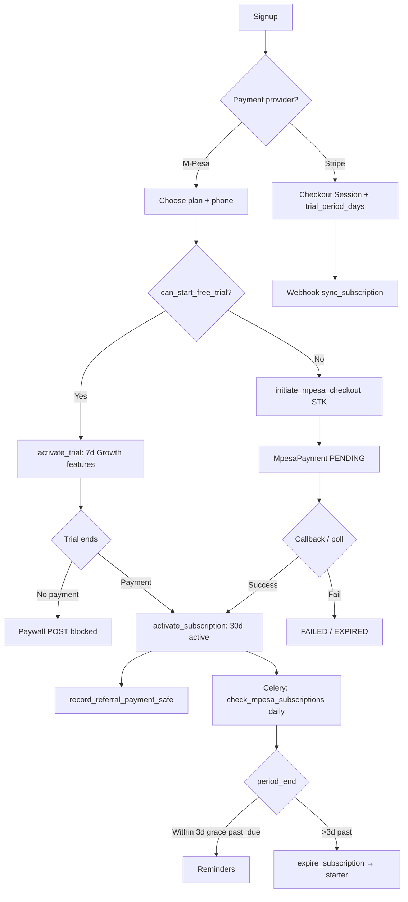

# Kova Financial Audit — Founder Report

> **Date:** 2026-05-31  
> **Scope:** `kova_agent` codebase — billing, metering, third-party costs, plan economics, loopholes  
> **Exchange rate assumption:** 1 USD ≈ 142 KES (used only where USD equivalents are derived from KES list prices)

---

## Executive Summary

Kova’s **authoritative plan prices** live in `apps/billing/models.py` (`PLAN_LIMITS`), overridable via admin `PlanPrice` rows: **Starter KES 499 / $4**, **Growth KES 999 / $7**, **Pro KES 1,999 / $14**, **Agency KES 2,999 / $21** (Agency is not public; sales/grandfather only). A **7-day trial** grants **Growth (Kazi) feature limits** regardless of selected tier.

**AI LLM COGS are small** when the production stack uses **DeepSeek V3.2** (~$0.03–$0.88/user/month at medium usage per internal models). **Photoroom, FLUX image generation, and WhatsApp marketing** are the dominant variable costs and can exceed subscription revenue on **Pro and Agency** at realistic heavy usage.

At **250 paying users** (realistic early-scale mix), modeled **monthly revenue ≈ $1,809** and **COGS ≈ $1,020–$1,280** depending on WhatsApp/Photoroom intensity → **gross margin ~29–44%** before sales/support/payment fees. **Agency and heavy Pro WhatsApp users are the primary loss vectors.**

**Top structural risks:** (1) unmetered LLM paths (WhatsApp AI, vision, cron tasks), (2) platform Photoroom pool exhaustion vs per-user caps, (3) Agency “unlimited” posts/seeds with high daily token ceilings, (4) trial re-registration via soft-deleted accounts, (5) WhatsApp broadcast/template costs uncapped in code.

---

## 1. Cost Inventory

### 1.1 Cost Stack Overview

| Layer | Provider / Setting | How consumed | Rate / cap (from code or docs) | Monthly driver |
|-------|-------------------|--------------|----------------------------------|----------------|
| **LLM — agents** | OpenAI / OpenRouter / Anthropic via `apps/agents/llm.py` | Per agent task; tiered via `AGENT_MODELS` + `get_model_for_task()` | Default: **DeepSeek V3.2** $0.26/$0.38 per 1M in/out (`MODEL_TOKEN_COSTS`) | Tokens × model price; retries/fallbacks multiply calls |
| **LLM — budget** | `apps/agents/budget.py` | `check_budget()` before `generate(user=…)` | Per-plan **`daily_llm_tokens`** (Starter 50K → Agency 2M) | Hard daily cap when `user` passed |
| **LLM — vision** | `analyze_image()` in `llm.py` | Snap-to-Sell, product tasks | **gpt-4o-mini** default; **no user budget gate** | ~$0.0003/call est. (`admin_dashboard/views/costs.py`) |
| **LLM — voice** | Whisper (referenced in costs dashboard) | Voice-to-seed | **$0.006/min** | Low volume |
| **AI images** | Together.ai FLUX (`TOGETHER_IMAGE_MODEL`) | Post media generation | Schnell $0.003, Krea $0.025, Pro $0.04/img | Plan `ai_images_per_month` |
| **Photoroom Plus** | `PHOTOROOM_API_KEY`, v2/edit API | Studio polish — **1 API call = 1 credit** (`photoroom_plus.py`) | Platform pool **`PHOTOROOM_MONTHLY_POOL=5000`**, reserve **500**, **`PHOTOROOM_MONTHLY_COST_USD=500`** → **~$0.10/image** at full pool | Per-user `visual_enhancements_per_month` + platform cap |
| **Web search** | Tavily (`TAVILY_API_KEY`) | Research agent | Free tier **1000 searches/mo** | Growth+ research |
| **Hosting** | **Railway** (`config/settings/production.py`) | web + Celery worker + beat + Postgres + Redis | ~**$20–80/mo** at 10–1000 users (`costs.py` `INFRA_COSTS`) | Sub-linear per user |
| **Media / CDN** | **Cloudflare R2** (S3-compatible) | User uploads, generated media | Free egress; storage ~$0.015/GB (`COST_ANALYSIS.md`) | Scales with media-heavy users |
| **Email** | **Resend** (mandatory prod) | Transactional + briefs + campaigns | Free **100 emails/day** (~3K/mo); paid above | `email_subscribers`, campaigns |
| **Payments — subs** | **M-Pesa Daraja** STK | Primary Kenya billing | **0% merchant fee** (Paybill) | `mpesa_services.py` |
| **Payments — subs** | **Stripe** | International / card | **2.9% + $0.30** + env price IDs | `billing/services.py` |
| **Payments — commerce** | M-Pesa separate callback | Product checkout (not subscription) | Same Daraja; revenue to **merchant user**, cost to Kova = API + infra | `MPESA_COMMERCE_CALLBACK_URL` |
| **WhatsApp** | Meta Cloud API | Inbox AI, briefs, broadcasts, templates | Service convos: **1K free/mo** then ~$0.04; Marketing **~$0.049/convo** (Kenya est.) | Pro+ only; **not metered in code** |
| **Monitoring** | **Sentry** (`SENTRY_DSN`) | Errors, Celery beat | Free 5K events; Team ~$26/mo | Optional in prod |
| **OAuth / social** | Meta, TikTok, LinkedIn, etc. | Publishing | Free tier APIs | Rate limits only |

### 1.2 LLM Model Routing & Token Economics

**Task → model resolution** (`apps/agents/llm.py` → `get_model_for_task`):

| Task key | Default model tier | Env override prefix |
|----------|-------------------|---------------------|
| `create.*`, `engage.reply` | Premium (`LLM_MODEL_PREMIUM`) | `LLM_MODEL_CREATE_*`, `LLM_MODEL_ENGAGE_REPLY` |
| `research.*`, `strategist.*` | Workhorse | `LLM_MODEL_RESEARCH_*`, `LLM_MODEL_STRATEGIST_*` |
| `analyst.*`, `adapt.schedule`, `engage.analyze` | Fast | `LLM_MODEL_ANALYST_*`, etc. |

**Production defaults** (`config/settings/base.py`): all tiers → **`deepseek/deepseek-v3.2`**.

**Fallback chain** (`generate()`): primary → free OpenRouter models (if `:free`) → **`LLM_PAID_FALLBACK`** (default `google/gemini-2.0-flash-001`). Up to **`max_retries`** (default 3) model attempts per user request — **each attempt can incur cost; budget checked once pre-call**.

**Per-plan daily token caps** (`PLAN_LIMITS`):

| Plan | `daily_llm_tokens` | Implied max if capped every day (30d) |
|------|---------------------|----------------------------------------|
| Starter | 50,000 | 1.5M tokens/mo |
| Growth | 200,000 | 6M |
| Pro | 500,000 | 15M |
| Agency | 2,000,000 | 60M |

At DeepSeek V3.2 blended ~$0.32/1M tokens, **Agency ceiling ≈ $19/mo LLM alone** — still below $21 revenue, but combined with images + Photoroom + WhatsApp → loss.

**Representative per-call token estimates** (from `docs/KOVA_AI_COST_ANALYSIS.md`):

| Task | In | Out | Notes |
|------|-----|-----|-------|
| `create.generate` | 1,500 + 150/platform | 500/platform | 1 call per seed |
| `strategist.brief` | 630 | 800 | Daily cron — cost floor |
| `analyst.performance` | 650 | 1,200 | Daily with brief |
| `engage.reply` | 500 | 120 | Per interaction |

**Medium monthly LLM COGS** (DeepSeek V3.2, single model — from internal cost model):

| Plan | Low | Medium | Max |
|------|-----|--------|-----|
| Starter | $0.034 | $0.037 | $0.039 |
| Growth | $0.057 | $0.096 | $0.144 |
| Pro | $0.115 | $0.245 | $0.406 |
| Agency | $0.291 | $0.878 | $1.827 |

### 1.3 Photoroom Economics

| Setting | Value | Source |
|---------|-------|--------|
| Platform monthly pool | **5,000** credits | `PHOTOROOM_MONTHLY_POOL` |
| Reserve (headroom) | **500** | `PHOTOROOM_POOL_RESERVE` |
| Usable platform cap | **4,500**/mo | `visual_credits.get_platform_photoroom_usage()` |
| Assumed subscription cost | **$500/mo** | `PHOTOROOM_MONTHLY_COST_USD` |
| Implied cost per image | **$0.111** at full pool (5000) or **$0.10** at 5000 list | `visual_credits.py` |
| Sandbox caps | 100/day, 1000/mo | `PHOTOROOM_SANDBOX_*` |

**Per-plan user caps** (`visual_enhancements_per_month`):

| Plan | Credits/mo | Plus variants/product |
|------|------------|----------------------|
| Starter | 30 | 3 |
| Growth | 100 | 5 |
| Pro | 200 | 7 |
| Agency | 500 | 10 |

**Important:** Each Photoroom variant = **1 API call = 1 credit** (`photoroom_plus.py`). A single “studio polish” session can burn **multiple credits** (scenes, channel exports, Edit-with-AI, preflight repairs up to `PHOTOROOM_PREFLIGHT_MAX_REPAIRS=2`).

**Platform vs user cap:** User may have credits remaining but be blocked when **`platform_blocked`** (`check_visual_credit_limit`).

### 1.4 Image Generation (FLUX)

| Plan | `ai_images_per_month` | Est. cost/image (Together) |
|------|----------------------|----------------------------|
| Starter | **0** | — |
| Growth | 50 | $0.025 (Krea) |
| Pro | 100 | $0.04 (FLUX Pro) |
| Agency | 500 | $0.04 |

Enforced in `create_agent.py` and content views — not via middleware.

### 1.5 Infrastructure (Railway + R2)

**Production topology** (`production.py`, `Procfile`, `COST_ANALYSIS.md`):

- **Railway:** Django web (Daphne/Gunicorn), Celery worker (concurrency 2), Celery beat, managed Postgres, Redis
- **R2:** Optional S3-compatible media; path-style; public media URLs for platform publishing
- **WhiteNoise:** Static assets on web dyno

| Scale (users) | Est. Railway + DB + Redis/mo |
|---------------|------------------------------|
| 10 | ~$20 |
| 100 | ~$30 |
| 250 | ~$55 |
| 500 | ~$50–80 |
| 1,000 | ~$80 |

### 1.6 Third-Party Summary

| Service | Billing model | Kova exposure |
|---------|---------------|---------------|
| M-Pesa Daraja (subscription STK) | No % fee on Paybill | API only |
| M-Pesa Daraja (commerce) | Customer → seller; Kova hosts webhook | Infra + support |
| Stripe | 2.9% + $0.30 | International subs |
| Resend | 100/day free | Briefs, auth, billing emails |
| Meta WhatsApp | Per conversation | **Pro+ features — high risk** |
| Sentry | Event-based | Ops |
| Shopify OAuth | Free API | Growth+ integration |

---

## 2. Billing Flow Audit

### 2.1 Subscription Lifecycle (M-Pesa Primary)



**Key files:** `apps/billing/mpesa_services.py`, `apps/billing/views.py`, `apps/billing/tasks.py`, `apps/billing/access.py`, `apps/billing/middleware.py`

### 2.2 Plan Enforcement Surfaces

| Limit | Enforced where | Gap |
|-------|----------------|-----|
| Seeds/month | Middleware POST on `content:submit_seed`, `voice_to_seed` | API/Celery may bypass if not calling `check_seed_limit` |
| Posts/month | `media_queue/tasks.py` → `check_post_limit` at publish | Creation not blocked in middleware (`CONTENT_CREATE_URLS = []`) |
| Social accounts | Middleware on connect | — |
| Competitor / Engage / WhatsApp / Memes | Middleware URL lists | GET-only views open (by design) |
| LLM tokens | `generate(user=…)` only | Many paths omit `user` (see §3) |
| Visual polish | `check_visual_credit_limit` in product views | Preflight may call Photoroom before final record |
| Email subscribers | `emails/marketing_views.py` | — |
| Email campaigns/mo | `marketing_views.py` | Sequences/automation volume partially separate |
| Campaigns | `campaigns/views.py` | Pro/Agency `999999` = unlimited |
| API access | `check_api_access` | Pro+ only |
| Subscription paywall | Middleware POST if trial/period lapsed | GET navigation still works; starter access after downgrade |

### 2.3 Trial & Referral Hooks

- **Trial:** `TRIAL_FEATURE_PLAN = "growth"` — trialing users get Growth limits (`get_effective_plan_tier`)
- **Trial eligibility:** `can_start_free_trial()` — false after any completed M-Pesa payment or `stripe_subscription_id` set
- **M-Pesa trial:** `activate_trial()` — no payment; sets `subscription_status=trialing`, `trial_ends_at = now + MPESA_TRIAL_DAYS` (default 7)
- **Referral:** `record_referral_payment()` on M-Pesa activation + Stripe invoice; 2 consecutive paid months → commission window 24mo; duplicate month guarded

### 2.4 Commerce vs Subscription

| | Subscription M-Pesa | Commerce M-Pesa |
|--|---------------------|-----------------|
| Model | `MpesaPayment` | `CommercePayment` |
| Callback | `MPESA_CALLBACK_URL` | `MPESA_COMMERCE_CALLBACK_URL` |
| Revenue to | Kova | End merchant |
| Plan gate | N/A | `mpesa_commerce` flag (Growth+) |
| COGS to Kova | LLM, hosting, Photoroom for merchant tools | Same — **merchant GMV ≠ Kova revenue** |

---

## 3. Loophole Register

| ID | Severity | Issue | Impact | Concrete fix |
|----|----------|-------|--------|--------------|
| L1 | **Critical** | WhatsApp AI calls `generate()` **without `user`** (`whatsapp/tasks.py`, `whatsapp/views.py`) | Bypasses `daily_llm_tokens`; unbounded LLM on Pro+ | Pass `conversation.user` / account owner; call `check_budget` + `record_usage` |
| L2 | **Critical** | `analyze_image()` has **no budget/metering**; product tasks use it freely | Vision costs uncapped; Snap pipeline on Growth+ | Add `user` param + token bucket; cap snaps/month per plan |
| L3 | **High** | **Trial re-registration:** `User.soft_delete()` frees email; `can_start_free_trial` only checks **current** user payments | Repeat 7-day Growth trials | Track trial consumption by email hash / phone / device fingerprint in `BillingEvent` or `UserProfile` flag surviving soft-delete |
| L4 | **High** | **Photoroom multi-call sessions** count as 1 `record_studio_polish` but preflight/scenes burn multiple API calls | Platform pool drain faster than credit accounting | Debit credits per API call; abort session when platform `at_limit` |
| L5 | **High** | **Agency unlimited** `max_posts_per_month`, `max_seeds_per_month`, `max_campaigns` = 999999 | Power users max daily 2M tokens × 30 + 500 images + 500 polish | Publish Agency only via sales contract; hard caps + overage pricing |
| L6 | **High** | **WhatsApp broadcasts/templates** not capped in `PLAN_LIMITS` | Marketing convos ~$0.049 each → Agency model shows **-$16/user** at heavy use (`COST_ANALYSIS.md`) | Add `whatsapp_marketing_messages_per_month`; enforce in broadcast launch |
| L7 | **Medium** | LLM **retry/fallback** tries up to 3 models; budget checked once | 3× cost on failures | Deduct estimated cost per attempt or aggregate pre-check |
| L8 | **Medium** | **`past_due` grace 3 days** still allows full POST access (`subscription_allows_app_access`) | Free usage after failed renewal | Restrict agent POSTs when `past_due`; allow billing + read-only |
| L9 | **Medium** | **`subscription_status=canceled`** returns access allowed → starter features forever | Churned users consume brief/cron LLM if still “active” users | Distinguish `canceled` + period ended → read-only |
| L10 | **Medium** | Cron briefs run for **all active subscribers** regardless of login | Daily brief floor ~98K tokens/user/mo | Skip brief if no login 14d; downgrade to weekly |
| L11 | **Medium** | **Admin `SubscriptionOverride`** comp/trial extension/bulk grant | Manual revenue leakage | Audit report + expiring comp caps in middleware |
| L12 | **Low** | **Discount codes** `max_uses=0` = unlimited | Promo abuse | Default max_uses; admin alert |
| L13 | **Low** | **Partner sandbox** Photoroom limits separate from prod pool | Dev burn if sandbox key shared | Keep `PHOTOROOM_SANDBOX=true` isolated |
| L14 | **Low** | **Stripe `allow_promotion_codes=True`** without mirrored M-Pesa discount governance | Inconsistent net revenue | Document parity; cap Stripe coupons |
| L15 | **Info** | Docs (`KOVA_LIFECYCLE.md`, `KOVA_COMPLETE_DOCUMENTATION.md`) show **old prices** (299/999/1999) | Founder confusion | Treat `PLAN_LIMITS` + DB `PlanPrice` as source of truth |

---

## 4. Plan Economics — Who Can Lose Money?

### 4.1 Unit Economics Matrix (Medium Usage, Production Stack)

Assumptions: DeepSeek V3.2 LLM; 60% of image/polish caps; Railway **$0.22/user** at 250 users; Photoroom allocated from **$500/mo pool**; WhatsApp **moderate** on Pro+ only.

| Plan | Revenue/mo | LLM | FLUX images | Photoroom alloc. | Infra | WhatsApp | **Total COGS** | **Gross margin** |
|------|------------|-----|-------------|------------------|-------|----------|----------------|------------------|
| Starter | **$4.00** | $0.04 | $0 | $0.60 | $0.22 | $0 | **$0.86** | **78%** |
| Growth | **$7.00** | $0.10 | $0.75 | $2.01 | $0.22 | $0 | **$3.08** | **56%** |
| Pro | **$14.00** | $0.25 | $2.40 | $4.02 | $0.22 | $3.00 | **$9.89** | **29%** |
| Agency | **$21.00** | $0.88 | $10.00 | $10.06 | $0.22 | $8.00 | **$29.16** | **−39%** ⚠️ |

**Loss drivers (ranked):**

1. **Agency** — 500 AI images + 500 polish + high LLM ceiling + WhatsApp marketing  
2. **Pro** — WhatsApp suite + 200 polish + 100 FLUX images at heavy use  
3. **Growth** — Photoroom at 100 polish/user if platform pool not shared fairly  
4. **Starter** — profitable unless GPT-4o-class models enabled platform-wide  

**Starter/Growth stay profitable** on LLM alone at any published price; **Agency at KES 2999 is structurally underpriced** for included visual + WhatsApp bundle unless usage is low or caps tightened.

### 4.2 Structural Changes — Zero-Loss on Paying Customers

| Change | Mechanism |
|--------|-----------|
| **Cap Agency publicly** | Remove 999999; set posts 300, seeds 120, polish 150, images 200 |
| **Overage pricing** | KES 10 per polish/image pack of 10; M-Pesa STK micro-payment |
| **WhatsApp pass-through** | Include 20 marketing convos/mo Pro; KES 5/additional |
| **Monthly LLM budget** | Replace daily-only with `monthly_llm_tokens` hard stop |
| **Photoroom pool guard** | When pool >80%, disable polish on Growth; Pro+ priority queue |
| **Model kill switch** | Env `LLM_MAX_COST_PER_1M` reject expensive models |
| **`emergency_pause` per user** | Already on profile — wire to cost spike alerts |
| **Raise Agency price** | Minimum **KES 4,999 (~$35)** for current bundle OR strip WhatsApp/images |

---

## 5. 250-User Scenario Model

### 5.1 User Mix & Usage Assumptions

| Assumption | Value |
|------------|-------|
| Total users | **250** (paying + in-trial treated as paying Growth for COGS) |
| Mix | **50% Starter** (125) · **30% Growth** (75) · **15% Pro** (38) · **5% Agency** (12) |
| Activity | **Medium** — ~80% of seed/post caps; daily brief active |
| LLM model | DeepSeek V3.2 (code default) |
| Photoroom | **Platform cap 4,500 usable/mo**; demand ~9,940 credits → **pool-saturated** |
| WhatsApp | Pro+ only: 38+12 users; ~15 marketing convos/user/mo avg |
| KES/USD | 142 |

### 5.2 Revenue Table

| Plan | Users | Price USD | Price KES | **MRR USD** | **MRR KES** |
|------|-------|-----------|-----------|-------------|-------------|
| Starter | 125 | $4 | 499 | $500 | 62,375 |
| Growth | 75 | $7 | 999 | $525 | 74,925 |
| Pro | 38 | $14 | 1,999 | $532 | 75,962 |
| Agency | 12 | $21 | 2,999 | $252 | 35,988 |
| **Total** | **250** | | | **$1,809** | **249,250** |

### 5.3 COGS Table (Monthly)

| Cost line | Calculation | **USD/mo** |
|-----------|-------------|------------|
| LLM (all users) | Weighted medium costs × users | **$48** |
| FLUX images | Growth 30×$0.025×75 + Pro 60×$0.04×38 + Agency 250×$0.04×12 | **$282** |
| Photoroom pool | Fixed subscription (saturated) | **$500** |
| Whisper / voice | Negligible | **$4** |
| Vision / Snap | ~50 users × 8 snaps × $0.0003 | **$1** |
| WhatsApp Meta | 50 WA users × blended $2.50 | **$125** |
| Railway + R2 + Redis | 250-user tier | **$55** |
| Resend email | ~4K emails (within free) | **$0** |
| Sentry | Free tier | **$0** |
| Tavily | <1000 searches | **$0** |
| **Total COGS** | | **~$1,015** |

### 5.4 Margin Summary

| Metric | Value |
|--------|-------|
| **Revenue** | $1,809 |
| **COGS** | ~$1,015 |
| **Gross profit** | ~$794 |
| **Gross margin** | **~44%** |
| **COGS / user** | ~$4.06 |
| **Revenue / user** | ~$7.24 |

### 5.5 Per-Plan Contribution (250-user mix)

| Plan | Rev/user | COGS/user (est.) | Profit/user | Plan total profit |
|------|----------|------------------|-------------|-----------------|
| Starter | $4.00 | $0.86 | +$3.14 | +$393 |
| Growth | $7.00 | $3.08 | +$3.92 | +$294 |
| Pro | $14.00 | $9.89 | +$4.11 | +$156 |
| Agency | $21.00 | $29.16 | **−$8.16** | **−$98** |

**Without 12 Agency users at medium-heavy usage, gross margin rises to ~48%.**

### 5.6 Photoroom Platform Note

Aggregate demand at medium usage:

```
125×12 + 75×40 + 38×80 + 12×200 = 9,940 credits requested
Usable pool = 4,500 → 55% of demand unmet (platform_blocked)
```

COGS stays **$500/mo** (contract); **product risk** is blocked users, not marginal dollar cost — unless Kova buys overage from Photoroom.

### 5.7 Feature-Level LLM Call Budget (Growth user, medium month)

| Feature | Est. calls/mo | Est. tokens | Est. cost (DS v3.2) |
|---------|---------------|-------------|---------------------|
| Daily brief + performance | 60 | ~120K | $0.04 |
| Seeds (24) × pipeline (create+DNA+predict) | 72 | ~350K | $0.11 |
| Engage analyze + reply | 40 | ~80K | $0.03 |
| Research / adapt | 20 | ~60K | $0.02 |
| **Total Growth medium** | | ~610K | **~$0.10** (matches model) |

---

## 6. Plan Comparison Matrix (Authoritative — Code)

| Feature | Starter | Growth | Pro | Agency |
|---------|---------|--------|-----|--------|
| **Price KES / USD** | 499 / **4** | 999 / **7** | 1,999 / **14** | 2,999 / **21** |
| Social accounts | 2 | 4 | 5 | 25 |
| Posts/mo | 15 | 60 | 150 | ∞ (999999) |
| Seeds/mo | 5 | 30 | 60 | ∞ |
| Daily LLM tokens | 50K | 200K | 500K | 2M |
| Agents | create, analyst | +research, adapt | +engage, strategist | all |
| AI images/mo | 0 | 50 | 100 | 500 |
| Studio polish/mo | 30 | 100 | 200 | 500 |
| WhatsApp | ❌ | ❌ | ✅ | ✅ |
| Memes | ❌ | ❌ | ✅ | ✅ |
| M-Pesa commerce | ❌ | ✅ | ✅ | ✅ |
| Email subscribers | 50 | 2,500 | 25,000 | ∞ |
| Email campaigns/mo | 2 | 10 | ∞ | ∞ |
| Team members | 0 | 0 | 5 | 25 |
| API | ❌ | ❌ | ✅ | ✅ |
| Trial days | 7 | 7 | 7 | 7 |
| Public signup | ✅ | ✅ | ✅ | ❌ (`public: False`) |

---

## 7. Recommendations

### 7.1 Pricing (90-day)

| Action | Rationale |
|--------|-----------|
| **Raise Pro to KES 2,499** and **Agency to KES 4,999+** (or sales-only custom) | Aligns with WhatsApp + visual COGS |
| **Keep Starter at KES 499** | Entry ARPU; LLM COGS tiny |
| **Introduce annual prepay** (2 months free) | M-Pesa monthly churn; improves cash flow |
| **WhatsApp add-on** KES 500/mo for Growth if ever enabled | Isolates Meta conversation risk |

### 7.2 Caps & Metering

1. Implement **`monthly_llm_tokens`** alongside daily cap.  
2. Pass **`user`** into all `generate()` / `analyze_image()` from Celery tasks.  
3. Add **`whatsapp_marketing_per_month`** to `PLAN_LIMITS`.  
4. **Per-API-call Photoroom debit** aligned with Photoroom billing.  
5. **Agency:** replace 999999 with finite caps + contract overrides in DB.

### 7.3 Kill Switches (env / admin)

| Switch | Location |
|--------|----------|
| `PHOTOROOM_*_ENABLED` flags | `base.py` |
| `AI_IMAGE_GENERATION_ENABLED` | `base.py` |
| `ADAPT_AGENT_V2_ENABLED` | `base.py` |
| `ENGAGE_GRADUATED_AUTONOMY_ENABLED` | `base.py` |
| `LLMConfig.paid_fallback_enabled` | DB admin |
| `UserProfile.emergency_pause` | Per-user |
| Platform pool block | Already in `visual_credits.py` |

### 7.4 Monitoring

- Use existing **`admin_dashboard/views/costs.py`** — reconcile `UserTokenBucket` vs `AgentAction` delta.  
- Alert when **Photoroom `remaining` < 500** or **Agency user COGS > revenue** (top consumers table).

---

## 8. Appendix — Code References

| Topic | Path |
|-------|------|
| Plan limits & prices | `apps/billing/models.py` — `PLAN_LIMITS`, `get_plan_limits`, `PlanPrice` |
| Trial logic | `apps/billing/models.py` — `TRIAL_FEATURE_PLAN`, `is_active_trial`, `get_effective_plan_tier` |
| LLM routing | `apps/agents/llm.py` — `get_model_for_task`, `generate`, `analyze_image` |
| Token budget | `apps/agents/budget.py`, `apps/billing/enforcement.py` |
| Model costs | `config/settings/base.py` — `MODEL_TOKEN_COSTS`, `AGENT_MODELS` |
| Pricing registry | `apps/agents/pricing.py` |
| Photoroom credits | `apps/billing/visual_credits.py` |
| Photoroom API | `apps/products/photoroom_plus.py`, `apps/products/photoroom_api.py` |
| M-Pesa billing | `apps/billing/mpesa_services.py`, `apps/billing/mpesa.py` |
| Stripe billing | `apps/billing/services.py`, `apps/billing/views.py` |
| Subscription access | `apps/billing/access.py` |
| Plan middleware | `apps/billing/middleware.py` |
| Post limit at publish | `apps/media_queue/tasks.py` |
| Referral billing | `apps/partners/referral_billing.py` |
| Cost dashboard | `apps/admin_dashboard/views/costs.py` |
| Production infra | `config/settings/production.py` |
| Env template | `.env.example` |
| Prior analyses | `docs/KOVA_AI_COST_ANALYSIS.md`, `docs/COST_ANALYSIS.md` |

---

*This report uses repository values as source of truth for prices and limits. External vendor rates (OpenRouter, Photoroom, Meta, Railway) are assumptions documented inline; verify against current vendor invoices before board/investor use.*
