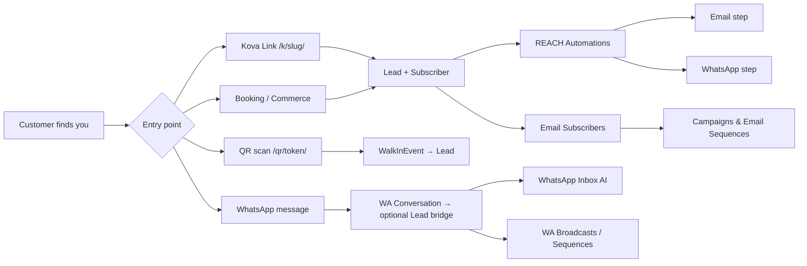

# Kova User Guide — WhatsApp, REACH & Email

> **Version**: 1.0 · **Last updated**: June 2026  
> **Audience**: Normal (non-admin) Kova users — business owners, marketers, and team members  
> **Scope**: Day-to-day use of **WhatsApp**, **REACH**, and **Email** inside the Kova app  
> **Not covered here**: Platform infrastructure (Meta app secrets, Resend DNS, Celery, webhooks). See [`KOVA_PLATFORM_SETUP_GUIDE.md`](./KOVA_PLATFORM_SETUP_GUIDE.md) for admin/developer setup.

---

## Table of Contents

1. [Introduction & prerequisites](#1-introduction--prerequisites)
2. [WhatsApp](#2-whatsapp)
3. [REACH](#3-reach)
4. [Email](#4-email)
5. [How the sections work together](#5-how-the-sections-work-together)
6. [FAQs & troubleshooting](#6-faqs--troubleshooting)
7. [Glossary](#7-glossary)
8. [Known gaps & contact support](#8-known-gaps--contact-support)

---

## 1. Introduction & prerequisites

### What this guide covers

Kova groups customer-facing communication and lead capture into three sidebar areas under **Customers**:

| Sidebar label | What it is | Primary URL |
|---------------|------------|-------------|
| **WhatsApp** | Business messaging inbox, AI replies, templates, Status Studio, broadcasts, sequences, analytics | `/whatsapp/` |
| **Reach** | Leads CRM, pipeline, Kova Links, walk-in QR, nurture automations, lead analytics | `/leads/` (and related paths) |
| **Email** | Subscriber lists, campaigns, drip sequences, automatic lead sync | `/emails/marketing/` |

Screenshot: Sidebar with Customers section expanded showing WhatsApp, Email, and Reach sub-navigation.

### Before you start

| Requirement | Why it matters |
|-------------|----------------|
| **Active Kova account** | Log in at your workspace URL |
| **Paid plan (or trial)** | Trial uses **Starter** limits. Some features are plan-gated — see below |
| **Brand profile filled in** | Settings → Brand improves AI replies (WhatsApp + Engage) |
| **Connected platforms** | WhatsApp requires **Pro+** and a connected WhatsApp Business account at `/platforms/` |

### Plan limits (Plan v2)

Authoritative source: [`KOVA_PLANS_GUIDE.md`](./KOVA_PLANS_GUIDE.md). Summary for this guide:

| Feature | Starter | Growth | Pro | Agency |
|---------|---------|--------|-----|--------|
| **WhatsApp Business module** (`whatsapp_enabled`) | No | No | **Yes** | **Yes** |
| WhatsApp morning brief | No | No | Yes | Yes |
| WhatsApp marketing conversations / month | 0 | 50* | 300 | 1,000 |
| **Max leads** | 10 (view-only) | 100 | 5,000 | 10,000 |
| Lead editing | No | Yes | Yes | Yes |
| Kova Link pages / links per page | 1 / 5 | 3 / 20 | 10 / 100 | (Agency limits) |
| Lead capture forms on links | No | Yes | Yes | Yes |
| **Email subscribers** | 50 | 2,500 | 25,000 | 100,000 |
| **Email lists** | 1 | 5 | 15 | 50 |
| **Email campaigns / month** | 2 | 10 | 30 | 50 |
| **Email nurture sequences** (REACH Automations) | 0 | 3 | 10 | 20 |
| **Email sequences** (Email app) | Plan cap via `email_sequences` | 3 | 10 | 20 |

\*Growth includes a **50/month marketing conversation cap** in plan metadata, but the full WhatsApp workspace (inbox, templates, broadcasts) requires **Pro**. Utility and authentication templates do **not** count toward the marketing cap.

When you hit **100% of any cap**, Kova blocks the action and shows an upgrade message. There are no automatic overage charges.

### Navigation map

```
Customers (sidebar)
├── Engage          → /engage/          (social comments/DMs — separate from WhatsApp)
├── WhatsApp        → /whatsapp/
│   ├── Inbox       → /whatsapp/
│   ├── Templates   → /whatsapp/templates/
│   ├── Status Studio → /whatsapp/status/
│   ├── Broadcasts  → /whatsapp/broadcasts/
│   └── Analytics   → /whatsapp/analytics/
├── Email           → /emails/marketing/
│   ├── Overview    → /emails/marketing/
│   ├── Campaigns   → /emails/campaigns/
│   ├── Subscribers → /emails/subscribers/
│   ├── Lists       → /emails/lists/
│   └── Sequences   → /emails/sequences/   (tab on Email pages)
└── Reach           → /leads/
    ├── Leads (inbox) → /leads/
    ├── Pipeline    → /leads/pipeline/
    ├── Links       → /links/
    ├── Walk-ins    → /qr/
    ├── Automations → /leads/nurture/
    └── Analytics   → /leads/analytics/
```

**Settings & connections** live under **Control → Settings** (`/accounts/settings/`) and **Platforms** (`/platforms/`).

---

## 2. WhatsApp

WhatsApp in Kova uses the **Meta WhatsApp Cloud API**. You connect your own WhatsApp Business number; Kova provides the inbox, AI assistant, templates, marketing tools, and analytics.

### 2.1 Who can use WhatsApp in Kova?

- **Pro (Biashara) and Agency (Wakala)** plans unlock the WhatsApp module (`whatsapp_enabled`).
- On **Starter** or **Growth**, the sidebar WhatsApp link redirects to **Pricing** (`/billing/pricing/`).
- You must connect WhatsApp under **Platforms** before the inbox shows conversations.

### 2.2 Connecting WhatsApp

**Path:** Control → **Platforms** (`/platforms/`) → WhatsApp card → **Connect WhatsApp** (`/platforms/connect/whatsapp/`)

Screenshot: Platforms page with WhatsApp Business card and green Connect button.

#### Option A — Embedded Signup (recommended, when available)

1. Click **Connect with WhatsApp** (green button).
2. Sign in with the Facebook account that manages your WhatsApp Business.
3. Complete Meta’s embedded signup flow.
4. On success, you return to Platforms and see your number connected with capabilities listed (AI Auto-Reply, Templates, Broadcasts, etc.).

#### Option B — Manual setup

If embedded signup is unavailable or you already have API credentials:

1. Expand **Already have a token? Manual setup →**
2. From [Meta Business Suite](https://business.facebook.com/settings):
   - **WhatsApp → API Setup** — copy **Phone Number ID** and **Business Account ID (WABA ID)**
   - **Users → System Users** — create an Admin system user
   - **Generate New Token** with `whatsapp_business_messaging` (and ideally `whatsapp_business_management`)
3. Paste **Phone Number ID**, **Business Account ID**, and **Access Token** into the form.
4. Click **Connect WhatsApp**.

**What you need from Meta (user checklist):**

- A phone number **not** registered on the consumer WhatsApp app
- Meta Business account (verification recommended for higher daily limits)
- WhatsApp Business Platform access on your Meta app

> **Note:** Token and webhook infrastructure are configured by Kova platform admins. If connection fails after correct credentials, contact support — do not share tokens in public channels.

### 2.3 WhatsApp Inbox

**Path:** Customers → **WhatsApp** → **Inbox** (`/whatsapp/`)

Screenshot: WhatsApp inbox stats bar and conversation list.

#### Empty state

If no account is connected, you see **Connect WhatsApp Business** with a **Connect Platform** button → `/platforms/`.

#### Stats bar

| Stat | Meaning |
|------|---------|
| Conversations | Total threads |
| Active | Ongoing conversations |
| Needs Human | Escalated — AI wants you to take over |
| AI Handling | Conversations where AI auto-reply is on |
| Messages Today | Inbound + outbound count for today |
| AI Replies | Auto-sent AI messages today |

#### Filters

Use dropdowns at the top:

- **All Statuses** / **Active** / **Needs Human** / **Closed**
- **All Languages** / **English** / **Swahili** / **Sheng**

Click **Clear** to reset filters.

#### Conversation list rows

Each row shows:

- Contact name (or WhatsApp ID if no name)
- Badges: **Needs Human**, **AI**, language tag
- Last message preview (`You:` prefix on outbound)
- **Window Open** (green) — free-form messaging allowed within Meta’s 24-hour window
- **Template Only** (amber) — window expired; templates required to re-engage

Click a row to open the conversation (`/whatsapp/conversation/<uuid>/`).

### 2.4 Conversations & messaging

**Path:** `/whatsapp/conversation/<uuid>/`

#### Header controls

| Element | Action |
|---------|--------|
| Contact name + phone | Who you’re messaging |
| **AI status toggle** | Green = AI on; gray = off (you reply manually) |
| Language tag | Detected language (en / sw / sheng) |
| Window status | Open vs template-only |

#### Message thread

- **Gray bubbles (left)** — customer inbound
- **Green bubbles (right)** — your outbound
- **🤖 AI** tag on AI-generated outbound
- Delivery icons: ✓ sent, ✓✓ delivered, ✓✓ blue read, ⚠ failed

#### Sending messages

**Window open:**

1. Type in the text box at the bottom.
2. Press **Enter** to send (Shift+Enter for newline).

**Window expired:**

- Free-text input is replaced with a template prompt.
- Use an **approved template** from **WhatsApp → Templates** to restart the conversation.

#### Escalation & drafts

When AI confidence is medium or low:

- **Yellow escalation banner** — explains why AI stopped; may show a draft reply.
- **Pending AI Drafts** — click **Approve & Send** or write your own message.

Toggle AI off in the header when you want full manual control; toggle back on to resume automation.

### 2.5 AI auto-reply

WhatsApp AI uses the same autonomy model as the Engagement Agent (`engage_autonomy_level` on your profile).

**Configure:** Control → **Settings** (`/accounts/settings/`) → **Engage autonomy level**

| Level | Behavior (WhatsApp + social) |
|-------|------------------------------|
| **Off** | No AI replies |
| **Suggest** | AI drafts; you approve every reply |
| **Graduated** | Auto-send high confidence (≥ 0.85); queue medium (0.50–0.85) |
| **Aggressive** | Auto-send at ≥ 0.70 (Agency plan only) |

The AI reads your **Brand Profile** (business name, voice, offerings, restrictions) and the last ~20 messages for context. It detects **English, Swahili, and Sheng** and replies in the customer’s language.

**Per-conversation override:** Use the AI toggle in the conversation header regardless of global setting.

### 2.6 The 24-hour customer service window

Meta policy (not Kova-specific):

```
Customer messages you → 24-hour window OPENS
  → You may send free-form text, media, AI replies
Customer’s last message + 24 hours → window CLOSES
  → Only approved TEMPLATES can initiate contact
Customer replies to template → window OPENS again
```

Kova tracks this automatically and shows **Window Open** vs **Template Only** in the inbox.

**Cost note:** Utility templates (booking confirmations, receipts) and authentication templates are treated differently from **marketing** templates for plan caps — see [Plan limits](#plan-limits-plan-v2).

### 2.7 Message templates

**Path:** WhatsApp → **Templates** (`/whatsapp/templates/`)

Templates are pre-approved message formats required outside the 24-hour window and for broadcasts/sequences.

#### Create a template

**Path:** `/whatsapp/templates/create/`

**Option A — AI Generate (recommended)**

1. Open **Create Template**.
2. Select **AI Generate**.
3. Describe the message (e.g. “Order confirmation with order number and delivery date”).
4. Click **Generate** — AI produces Meta-compliant name, category, body with `{{1}}`, `{{2}}` variables.
5. Review and save as **Draft**.

**Option B — Manual**

1. **Name** — lowercase_with_underscores only (e.g. `order_confirmation`)
2. **Category** — Marketing, Utility, or Authentication
3. **Body** — text with `{{1}}`, `{{2}}`, … for dynamic fields
4. **Footer** (optional)
5. **Language** — default `en`

#### Submit and sync

| Action | Button / URL | Result |
|--------|--------------|--------|
| Submit to Meta | **Submit to Meta** on template row (`/whatsapp/templates/<uuid>/submit/`) | Status → **Submitted** |
| Sync from Meta | **Sync from Meta** (`/whatsapp/templates/sync/`) | Pulls Approved / Rejected / Paused |

#### Template lifecycle

```
Draft → Submitted → Approved ✅
                  → Rejected ❌ (check reason, revise)
                  → Paused ⏸️ (quality issues — high block rate)
```

**Tips for approval:** Be specific, match actual use, include opt-out language for marketing, avoid prohibited content.

Screenshot: Template list with status badges and Submit/Sync actions.

### 2.8 Broadcasts

**Path:** WhatsApp → **Broadcasts** (`/whatsapp/broadcasts/`)

Send an approved template to many WhatsApp contacts at once.

#### Create a broadcast

1. Expand **New Broadcast**.
2. Enter **Campaign Name** (e.g. `Friday Special Blast`).
3. Click **Create Broadcast**.
4. On the detail page (`/whatsapp/broadcasts/<uuid>/`):
   - Attach an **approved template**
   - Define **target segment** (tags, language, last active, etc.)
   - Set **template variables** per recipient
   - Optionally schedule send time
5. Click **Launch** (`/whatsapp/broadcasts/<uuid>/launch/`).

#### Broadcast statuses

| Status | Meaning |
|--------|---------|
| Draft | Not yet sent |
| Scheduled | Queued for future time |
| Sending | In progress |
| Paused | Stopped mid-send — use **Pause** |
| Completed | Finished |

#### Metrics (detail page)

Recipients · Sent · Delivered · Failed — updated via Meta delivery webhooks.

**Marketing cap:** Each distinct conversation contacted with a **marketing** template counts toward your plan’s `whatsapp_marketing_conversations_per_month`. Utility/auth templates do not.

**Processing:** Broadcasts are processed by background jobs (~every 30 minutes). Large sends may not finish instantly.

### 2.9 Drip sequences (WhatsApp)

**Path:** Same **Broadcasts** page — section **Drip Sequences**

#### Create a sequence

1. Expand **New Drip Sequence**.
2. **Sequence Name** (e.g. `New Customer Onboarding`)
3. **Type:** Onboarding · Re-engagement · Cart Abandonment · Post Purchase · Custom
4. Click **Create Sequence** → detail page (`/whatsapp/sequences/<uuid>/`)

#### Manage steps

On the sequence detail page:

- **Add Step** (`/whatsapp/sequences/<uuid>/add-step/`) — template, delay, variables
- **Toggle** active/paused (`/whatsapp/sequences/<uuid>/toggle/`)

**Auto-enrollment:** New WhatsApp conversations can enroll in active **onboarding** sequences automatically when configured.

### 2.10 Status Studio

**Path:** WhatsApp → **Status Studio** (`/whatsapp/status/`)

AI-curated content for **WhatsApp Status** (Stories-style updates).

#### Stats

Total · Ready · Shared · Drafts

#### Create status content

Expand **Create Status Content**:

- **AI Generate** — describe what to promote; pick category; **Generate with AI**
- **Manual** — write status text (ideal ~200 chars)

Actions on each item:

- **Share** (`/whatsapp/status/<uuid>/share/`) — mark as shared to Status
- **Skip** — dismiss from queue
- **Repurpose from post** (`/whatsapp/status/repurpose/<post_id>/`) — turn a published post into status copy

**Calendar view:** `/whatsapp/status/calendar/` — plan status across the week.

**Daily queue:** Kova can generate a daily status queue automatically (background job).

Screenshot: Status Studio with AI generate form and ready-to-share cards.

### 2.11 Analytics & digests

**Path:** WhatsApp → **Analytics** (`/whatsapp/analytics/`)

Track conversation volume, AI performance, broadcast results, and weekly digests.

- **Digest detail:** `/whatsapp/analytics/digest/<uuid>/`
- Weekly digest generation runs automatically on Pro+ with WhatsApp connected.

### 2.12 WhatsApp Channels

**Path:** `/whatsapp/channels/` (not in main sidebar — bookmark or navigate directly)

Register WhatsApp **Channels** (broadcast-style follower channels):

1. **Register Channel** — name, optional Meta Channel ID, description
2. Open channel detail — create posts, **Publish**, toggle **Auto-Curate** (AI pulls content every ~6 hours)

Screenshot: Channels dashboard with follower and reach stats.

### 2.13 Automatic WhatsApp messages (no manual send)

These fire from other Kova modules — you configure the source, not each message:

| Trigger | What gets sent | Where configured |
|---------|------------------|------------------|
| **M-Pesa commerce payment** | Payment receipt template | Commerce checkout (Growth+ M-Pesa) |
| **Booking confirmed** | Confirmation via WhatsApp | Bookings module |
| **Daily brief (Pro+)** | Morning brief ping | Settings → **WhatsApp morning ping** (`brief_whatsapp_enabled`) |
| **REACH nurture step** | WhatsApp template/text when lead has phone | Reach → Automations (see §3.6) |
| **Onboarding drip** | Sequence steps for new WA conversations | WhatsApp → Broadcasts → Sequences |

**Commerce receipts:** Sent automatically on successful M-Pesa payment. There is **no end-user settings screen** for receipt templates — contact support if receipts fail.

### 2.14 WhatsApp morning brief (Pro+)

**Path:** Control → **Settings** → enable **WhatsApp morning ping**

Requires Pro plan + connected WhatsApp. Sends a template-based morning summary with links/actions. See [`DAILY_BRIEF_WHATSAPP_SETUP.md`](./DAILY_BRIEF_WHATSAPP_SETUP.md) for template structure (admin reference).

### 2.15 Day-to-day WhatsApp workflow

**Recommended daily routine:**

1. Open **WhatsApp → Inbox** — clear **Needs Human** escalations first.
2. Approve pending AI drafts or turn off AI on sensitive threads.
3. Check **Window Open** vs **Template Only** before bulk manual replies.
4. Review **Analytics** weekly; adjust templates/broadcasts.
5. Use **Status Studio** 2–3× per week for organic reach.

**Weekly:**

- Sync templates after Meta approvals.
- Plan one **Broadcast** or review drip **Sequence** performance.
- Refresh brand profile if AI tone drifts.

---

## 3. REACH

**REACH** is Kova’s lead capture and nurture hub — turning link clicks, forms, walk-ins, bookings, commerce, and WhatsApp into a single CRM-lite pipeline with automations.

Sidebar label: **Reach** (section header) with sub-items when active.

### 3.1 What REACH means in Kova

REACH connects **attention → lead → follow-up → sale**:

```
Sources (Links, QR, forms, social, commerce, bookings, WhatsApp)
        ↓
   Lead record (/leads/)
        ↓
   Scoring & pipeline (/leads/pipeline/)
        ↓
   Automations (/leads/nurture/) → Email and/or WhatsApp steps
        ↓
   Email subscribers (/emails/) — synced from leads
```

### 3.2 Leads inbox

**Path:** Reach → **Leads (inbox)** (`/leads/`)

Tabs at top: **Inbox** · **Pipeline** · **Nurture** · **Analytics**

#### Stats

Total Leads · New · Qualified · Converted

#### Filters

- Search box (`q`)
- **Status:** New · Contacted · Qualified · Converted · Lost
- **Priority:** High · Medium · Low
- **Source:** Form submissions · Walk-ins · QR scans · Commerce · Bookings · (others)

#### Actions

- **+ Add Lead** (`/leads/create/`) — manual entry
- **Analytics** — shortcut to lead analytics

#### Lead sources (automatic)

| Source type | How it appears |
|-------------|----------------|
| `form_submission` | Kova Link form submit |
| `walk_in` | Cashier walk-in capture |
| `qr_scan` | QR attribution (when phone collected) |
| `commerce_purchase` | Snap2sell / M-Pesa checkout |
| `booking` | Public booking link |
| `social_dm` / `social_comment` | Engage bridge (when configured) |
| `manual` | You added manually |

**Starter plan:** Max **10** leads, **view-only** (no edit). Upgrade to Growth+ to edit and scale.

### 3.3 Lead detail

**Path:** `/leads/<uuid>/`

#### Profile card

Name, email, phone, status badge, priority, source, first seen / last activity.

#### Quick status change

Buttons: **New** · **Contacted** · **Qualified** · **Converted** · **Lost** — updates instantly (HTMX).

#### Intelligence score

If present, shows **composite score** from daily scoring job (engagement + source signals).

#### Activity timeline

Chronological touchpoints: form submitted, email sent/opened, WhatsApp sent, walk-in, booking, tags, notes, etc.

#### Edit lead

**Edit** button (`/leads/<uuid>/edit/`) — requires Growth+ (`leads_can_edit`).

#### Tags & notes

- Add note: `/leads/<uuid>/note/`
- Add/remove tags: `/leads/<uuid>/tag/` and `/tag/remove/`

### 3.4 Pipeline

**Path:** Reach → **Pipeline** (`/leads/pipeline/`)

Kanban-style columns by status: **New → Contacted → Qualified → Converted → Lost**

- Read-only columns (no drag-and-drop yet) — tap a card to open lead detail.
- Shows priority and composite score on cards.

Screenshot: Horizontal pipeline columns with lead cards.

### 3.5 Kova Links (lead capture pages)

**Path:** Reach → **Links** (`/links/`)

Build **link-in-bio** pages with tracked links and optional lead forms.

#### Create a page

1. **Links** → create page (`/links/create/`)
2. Add **links** (`/links/<page_id>/links/add/`) — URL, label, optional UTM
3. Add **forms** (`/links/<page_id>/forms/add/`) — Growth+ for lead capture forms on Starter

#### Public URL

Your page lives at:

```
https://<your-kova-domain>/k/<your-page-slug>/
```

Form submissions create **Lead** records and **EmailSubscriber** entries (when email provided).

#### Submissions

Legacy path `/links/submissions/` redirects to **`/leads/?source=form_submission`**. Use Leads inbox with source filter instead.

**Plan limits:** Pages and links per page vary by tier (see [Plan limits](#plan-limits-plan-v2)).

### 3.6 Walk-ins & QR attribution

**Path:** Reach → **Walk-ins** (`/qr/`)

Track physical-world attribution: QR codes on posters, tables, receipts, and staff cashier capture.

#### QR codes

| Action | URL |
|--------|-----|
| List QR codes | `/qr/` |
| Create | `/qr/new/` |
| Detail / edit / delete | `/qr/<uuid>/` |
| Print PDF | `/qr/<uuid>/print/` |

**Public scan URL:** `/qr/<token>/` — landing page with attribution tracking.

> **Gap:** Scan alone does not always create a lead unless phone/name is collected on landing or via cashier. See [§8](#8-known-gaps--contact-support).

#### Staff cashier (walk-in capture)

**Path:** `/walkin/` (logged in) — get your cashier link

**Public cashier UI:** `/walkin/<your-slug>/`

Staff tablet/phone flow:

1. Optional revenue amount field
2. Tap source button (“Instagram”, “Friend”, “Walk-by”, etc.)
3. Optionally capture customer name + phone → creates **WalkInEvent** and **Lead**

Walk-in leads trigger **`from_walk_in`** nurture automations when configured.

Screenshot: Cashier “Where did you hear about us?” grid on phone.

### 3.7 Automations (nurture sequences)

**Path:** Reach → **Automations** (`/leads/nurture/`)

Multi-step follow-ups that run on a schedule (~every 30 minutes via background processing).

#### List automations

See all sequences, triggers, active/paused state, enrollment counts.

#### Create automation

**Path:** `/leads/nurture/create/`

1. **Sequence Name**
2. **Trigger** — when leads enter:

| Trigger value | Label in UI | When it fires |
|---------------|-------------|---------------|
| `all_new` | All new leads | Any new lead |
| `from_form` | From form submissions | Form capture |
| `from_social` | From social (DMs & comments) | Social sources |
| `high_priority` | High-priority leads only | Score/priority gate |
| `from_platform` | From specific platform | + platform field (e.g. instagram) |
| `from_commerce` | From commerce purchases | After checkout |
| `from_booking` | From bookings | After booking |
| `from_walk_in` | From walk-ins | Cashier / walk-in |
| `from_qr_scan` | From QR scans | QR with lead bridge |
| `stale_winback` | Stale leads (7+ days inactive) | Daily re-engagement job |
| `manual` | Manual enrollment only | You enroll by hand |

3. **Steps** — add one or more:

| Action | What it does |
|--------|--------------|
| **Send Email** | Subject + body to lead’s email |
| **Add Tag** | Tag value on lead |
| **Change Status** | Move to New/Contacted/Qualified/etc. |

4. **Delay** — hours after previous step (0 = immediately)

5. Save — sequence is **Active** by default.

#### Default welcome sequence

On first lead, Kova may auto-create a default welcome sequence (`ensure_default_nurture_sequences`). You can also run admin command `ensure_welcome_nurture` (support/onboarding).

#### WhatsApp in nurture

The backend supports **`send_whatsapp`** steps (prefers WhatsApp when lead has phone). The **create/edit form UI currently lists only Send Email, Add Tag, and Change Status** — WhatsApp steps may require support to configure. When active, WhatsApp nurture uses the same Cloud API path as the inbox.

#### Manage existing automation

**Detail:** `/leads/nurture/<uuid>/`

- View step timeline and enrolled leads
- **Pause** / **Activate** toggle

**Plan cap:** `email_sequences` in plan limits counts nurture sequences (0 on Starter).

### 3.8 Lead scoring & stale win-back

Background jobs (you don’t run these manually):

| Job | Frequency | Effect |
|-----|-----------|--------|
| `score_all_leads` | Daily | Composite score in lead metadata; may auto-enroll high-priority leads |
| `process_nurture_steps` | Every 30 min | Sends next email/WhatsApp/tag/status step |
| `reengage_stale_leads` | Daily | Enrolls inactive 7+ day leads into `stale_winback` sequences |

### 3.9 REACH analytics

**Path:** Reach → **Analytics** (`/leads/analytics/`)

Funnel and source breakdown — which channels produce leads and conversions. Use alongside **Snap2sell → Performance** for full marketing picture.

### 3.10 Day-to-day REACH workflow

**Daily:**

1. Open **Leads inbox** — filter **New**, respond or change status.
2. Check **Pipeline** for qualified leads stuck in column.
3. Review walk-in / form sources if running physical promos.

**Weekly:**

1. Tune **Automations** — pause underperforming sequences.
2. Update **Links** page for current campaigns.
3. Reprint or create **QR codes** for new locations.

**On launch:**

1. Publish Kova Link with form (Growth+).
2. Activate **All new leads** or **From form** welcome automation.
3. Enable **Email → Auto on** so subscribers sync (§4.2).

---

## 4. Email

Kova’s **Email** section is **marketing email** to your subscribers — distinct from transactional emails (password reset, billing, daily brief) which Kova sends automatically via the platform mail system.

**You do not configure SMTP or Resend** as an end user. The platform sends from Kova’s configured domain (`DEFAULT_FROM_EMAIL`). Your job: build lists, campaigns, and sequences; comply with unsubscribe rules.

### 4.1 Email overview dashboard

**Path:** Customers → **Email** → **Overview** (`/emails/marketing/`)

Sub-nav tabs: **Overview · Campaigns · Subscribers · Lists · Sequences**

#### Auto email strip

| State | Meaning |
|-------|---------|
| **Kova handles email automatically** | `auto_email_marketing` ON on your profile |
| **Automatic email is paused** | Auto OFF — manual campaigns still work |

**Auto on/off button:** POST to `/emails/automation/toggle/`

When auto is ON, Kova:

- Syncs **leads & forms → subscribers**
- Can draft/send campaigns from top posts
- Enrolls new contacts in **welcome sequence**

#### Stats cards

Active Subscribers · Campaigns Sent · Emails Sent · Total Opens

#### Quick actions

- **View campaigns**
- **Subscribers (N)**
- **Sync leads now** (`/emails/sync/`) — manual backfill from leads

### 4.2 Subscribers

**Path:** `/emails/subscribers/`

#### Sources (automatic tags)

| Source | Origin |
|--------|--------|
| `lead_sync` | Daily sync from REACH leads |
| `kova_form` | Link form submission |
| `manual` | You added manually |
| `import` | CSV/import |
| `social_bio` | Social bio capture |
| `api` | API integration |

#### Add subscriber manually

**Path:** `/emails/subscribers/add/`

Blocked at plan subscriber cap with upgrade prompt.

#### Subscriber statuses

**Active** · **Unsubscribed** · **Bounced** · **Complained**

- 3 bounces → auto-bounced
- Complaint → immediate unsubscribe
- One-click unsubscribe: `/emails/unsubscribe/<token>/` (public, no login)

### 4.3 Lists

**Path:** `/emails/lists/`

| Action | URL |
|--------|-----|
| All lists | `/emails/lists/` |
| Create | `/emails/lists/create/` |
| Detail | `/emails/lists/<uuid>/` |
| Edit | `/emails/lists/<uuid>/edit/` |

**Static lists** — manually assigned subscribers.

**Smart lists** (`is_smart`) — auto-populate from rules (tags, source, engagement score). View on list detail.

Default **All contacts** list is created during onboarding when auto email bootstrap runs.

### 4.4 Campaigns

**Path:** `/emails/campaigns/`

#### Quick send (recommended)

**Path:** `/emails/campaigns/create/`

1. Enter a plain-language **prompt** (“Announce our Easter sale — 20% off bookings this week”).
2. Click **AI write & send** — Kova drafts HTML, targets your list, queues send.

#### Advanced manual campaign

Expand **Advanced — edit HTML manually**:

- Name, subject, preview text, HTML body, target list, schedule

#### Campaign detail

**Path:** `/emails/campaigns/<uuid>/`

Metrics: sent, opened, clicked, bounced, unsubscribed. **Send** button for draft/scheduled (`/campaigns/<uuid>/send/`).

#### Campaign statuses

Draft → Scheduled → Sending → Sent (or Cancelled)

**Plan limit:** `email_campaigns_per_month` — hard stop with upgrade message.

**Scheduled sends:** Processed every ~15 minutes by background job.

### 4.5 Email sequences (drip)

**Path:** `/emails/sequences/` (tab on Email sub-nav)

Separate from **REACH Automations** — these enroll **email subscribers**, not CRM leads directly (though subscribers often originate from leads).

| Trigger types | Examples |
|---------------|----------|
| `form_submission` | Specific Kova form |
| `tag_added` | Subscriber tag |
| `subscriber_added` | Joins a list |
| `lead_status_change` | CRM status change |
| `manual` | Manual only |

**Detail:** `/emails/sequences/<uuid>/` — steps, delays (days/hours), enrollments.

**Processing:** Every ~30 minutes — advances enrollments, sends next step.

**Welcome sequence:** Shown on dashboard when active (“new contacts get N automated emails”).

### 4.6 Compliance & deliverability (user responsibilities)

| Rule | What to do |
|------|------------|
| **Permission** | Only email people who opted in (forms, checkout, explicit consent) |
| **Unsubscribe** | Every marketing email includes unsubscribe link — honor instantly |
| **Content** | No deceptive subjects; include business identity |
| **Bounces** | Remove bad addresses; Kova auto-marks after 3 bounces |
| **Complaints** | Spam reports auto-unsubscribe — avoid buying lists |

Transactional emails (receipts, password reset) are separate and cannot be unsubscribed from account-security messages.

### 4.7 Email vs transactional mail

| Type | Examples | User controls? |
|------|----------|----------------|
| **Marketing** (this guide) | Campaigns, sequences, nurture emails | Yes — Email & REACH sections |
| **Transactional** | Welcome, billing, team invite, daily brief | Automatic — Settings toggles for brief only |

### 4.8 Day-to-day Email workflow

**Daily:**

- Glance at **Overview** stats; toggle **Auto on** if you want hands-off nurture.

**Weekly:**

1. **Sync leads now** if you added leads outside forms.
2. Send one **campaign** (AI quick send or scheduled).
3. Review **Sequences** enrollments and completion rates.

**Monthly:**

- Clean **Subscribers** — filter bounced/unsubscribed.
- Archive underperforming **Lists** or tighten smart list rules.

---

## 5. How the sections work together

### 5.1 Typical customer journey



### 5.2 Data sync rules

| From | To | How |
|------|-----|-----|
| Lead (with email) | Email subscriber | Daily sync + manual **Sync leads now** |
| Form submission | Lead + subscriber | Immediate on submit |
| Walk-in with phone | Lead | Immediate on cashier save |
| WhatsApp conversation | Engage inbox bridge | Webhook (internal) |
| Commerce payment | Lead + WA receipt | Webhook + optional template |

### 5.3 Recommended stack by business type

| Business | WhatsApp | REACH | Email |
|----------|----------|-------|-------|
| **Retail shop** | Order updates + promos (Pro) | QR at counter + walk-in cashier | Weekly sale campaign |
| **Service studio** | Booking confirmations + reminders | Link page + booking leads | Nurture sequence after inquiry |
| **E-commerce** | Cart abandonment sequence | Commerce purchase trigger | Post-purchase email drip |
| **Starter solo** | Not available | 1 link page, 10 leads view-only | 2 campaigns/mo, 50 subs |

### 5.4 Settings that affect all three

**Path:** `/accounts/settings/`

| Setting | Affects |
|---------|---------|
| Brand profile | WhatsApp AI + email AI tone |
| `engage_autonomy_level` | WhatsApp + Engage AI send behavior |
| `brief_whatsapp_enabled` | Morning WhatsApp ping (Pro+) |
| `brief_email_enabled` | Daily brief email (Growth+) |
| `auto_email_marketing` (Email dashboard toggle) | Subscriber sync + auto campaigns |

---

## 6. FAQs & troubleshooting

### WhatsApp

**Q: Sidebar WhatsApp goes to Pricing.**  
A: Upgrade to **Pro+** (`whatsapp_enabled`). Growth does not include the WhatsApp workspace.

**Q: Inbox says “Connect WhatsApp Business”.**  
A: Connect at `/platforms/connect/whatsapp/`. Verify Meta credentials or complete embedded signup.

**Q: Messages send but customers don’t receive.**  
A: Check template approval for outbound-initiated chats; verify 24h window; confirm Meta quality rating in Platforms. Contact support if webhook/delivery issues persist.

**Q: AI replies in wrong language.**  
A: Customer must use detectable Swahili/Sheng cues; override manually and toggle AI off for that thread.

**Q: Broadcast blocked.**  
A: Likely **marketing conversation cap** — check plan usage or use **utility** template category where appropriate.

**Q: Template stuck on Submitted.**  
A: Click **Sync from Meta**; Meta review can take minutes (utility) to hours (marketing).

### REACH

**Q: Form submission not in Leads.**  
A: Confirm Growth+ forms enabled; check `/leads/?source=form_submission`; verify page slug and form active.

**Q: Can’t edit lead on Starter.**  
A: Starter is view-only — upgrade to Growth+.

**Q: Hit lead limit.**  
A: Upgrade plan or archive/convert old leads to free slots.

**Q: Pipeline won’t drag.**  
A: Expected — kanban is read-only; change status on lead detail.

**Q: QR scan didn’t create lead.**  
A: Scan tracking works; lead creation needs phone/name capture — use cashier or form landing. See [§8](#8-known-gaps--contact-support).

### Email

**Q: Campaign says no subscribers.**  
A: Run **Sync leads now**; confirm list has **active** members; check subscriber cap.

**Q: High bounce rate.**  
A: Remove invalid emails; avoid purchased lists; verify customers typed email correctly on forms.

**Q: Auto email paused — what still works?**  
A: Manual campaigns and REACH email nurture steps still send; auto welcome/top-post campaigns stop.

**Q: Unsubscribe not working.**  
A: Link format `/emails/unsubscribe/<token>/` — contact support if 404 (rare token mismatch).

**Q: Can I use my own domain for sending?**  
A: Not self-serve today — platform sends via Kova/Resend configuration. Contact support for custom sender requirements.

### Cross-module

**Q: WhatsApp vs Engage inbox?**  
A: **WhatsApp** (`/whatsapp/`) = WhatsApp Cloud API. **Engage** (`/engage/`) = Instagram/Facebook/TikTok comments & DMs. Both may appear in operations views but are separate in the UI.

**Q: Two types of “sequences”?**  
A: Yes — **REACH Automations** (`/leads/nurture/`) operate on **leads**; **Email Sequences** (`/emails/sequences/`) operate on **subscribers**. They can complement each other.

---

## 7. Glossary

| Term | Definition |
|------|------------|
| **24-hour window** | Meta period after customer message when free-form replies are allowed |
| **Automation (REACH)** | Nurture sequence on leads — `/leads/nurture/` |
| **Broadcast** | One-to-many WhatsApp template send |
| **Cloud API** | Meta’s HTTPS API for WhatsApp Business |
| **Composite score** | Daily lead priority score stored in lead metadata |
| **Drip sequence** | Multi-step delayed messages (WhatsApp or Email) |
| **Embedded Signup** | Meta OAuth flow to connect WABA without manual tokens |
| **Engage** | Social engagement inbox (not WhatsApp) |
| **Kova Link** | Link-in-bio page at `/k/<slug>/` |
| **Lead** | CRM contact record — one per email per workspace |
| **Marketing conversation** | WhatsApp distinct contact messaged via **marketing** template (plan cap) |
| **Nurture** | Automated follow-up steps after lead capture |
| **REACH** | Kova product name for leads, links, QR, walk-ins, automations |
| **Smart list** | Email list auto-filtered by rules |
| **Status Studio** | WhatsApp Status content queue |
| **Subscriber** | Email marketing contact (may link to Lead) |
| **Template** | Meta-pre-approved WhatsApp message format |
| **Utility template** | Transactional WA template (confirmations) — excluded from marketing cap |
| **WABA** | WhatsApp Business Account ID in Meta |
| **Walk-in** | In-person attribution via cashier or QR |

---

## 8. Known gaps & contact support

The following are **known limitations** in the current product (June 2026). If behavior differs from this guide, contact Kova support.

| Gap | Impact | Workaround |
|-----|--------|------------|
| **QR scan → Lead** without phone | Scan tracked; lead may not auto-create | Use cashier capture or form on landing page |
| **Send WhatsApp** nurture step | Backend supports; **not in Automations form UI** | Contact support to add `send_whatsapp` steps |
| **Pipeline drag-and-drop** | Read-only kanban | Change status on lead detail |
| **Commerce receipt templates** | Auto-sent on M-Pesa success; no user editor | Contact support for template issues |
| **WhatsApp Channels** | Available at `/whatsapp/channels/` but not in sidebar | Bookmark URL |
| **Custom email sending domain** | Platform-managed Resend | Contact support for enterprise sender needs |
| **Admin dashboard** | `/dashboard/` — staff only | Not for normal users |

**Contact support when:**

- WhatsApp connected but zero inbound messages after customer test
- Template approved in Meta but rejected/stuck in Kova after Sync
- Plan limits appear incorrect after upgrade
- GDPR/data deletion requests for leads or subscribers
- Any payment receipt or booking WhatsApp not delivering

---

## Related documentation

| Document | Use |
|----------|-----|
| [`KOVA_PLANS_GUIDE.md`](./KOVA_PLANS_GUIDE.md) | Full plan comparison |
| [`WHATSAPP_SETUP_GUIDE.md`](./WHATSAPP_SETUP_GUIDE.md) | WhatsApp admin + extended user reference |
| [`WHATSAPP_STRATEGY_AND_AUDIT.md`](./WHATSAPP_STRATEGY_AND_AUDIT.md) | Architecture (technical) |
| [`REACH_LEAD_AUTOMATION_AUDIT.md`](./REACH_LEAD_AUTOMATION_AUDIT.md) | REACH implementation notes |
| [`KOVA_EMAIL_DOCUMENTATION.md`](./KOVA_EMAIL_DOCUMENTATION.md) | Email system (developer reference) |
| [`KOVA_PLATFORM_SETUP_GUIDE.md`](./KOVA_PLATFORM_SETUP_GUIDE.md) | Meta/Resend infrastructure (admins) |

---

*End of user guide.*
